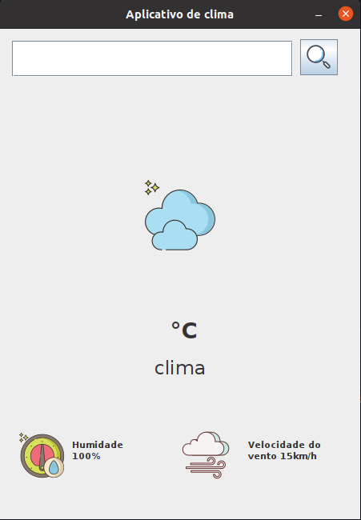

<h1 align="center"> Aplicativo de Clima </h1>

O Weather App é um aplicativo baseado em Java que oferece informações meteorológicas em tempo real para um local específico.
  Ele busca dados meteorológicos de uma API externa e os apresenta em uma Interface Gráfica de Usuário (GUI). 
  Os usuários podem inserir um local, e o aplicativo recupera e exibe detalhes meteorológicos, como temperatura, condições climáticas, umidade e velocidade do vento. 
  
  

  

## 💻 Projeto

O principal propósito do Weather App é fornecer uma plataforma intuitiva e acessível para acompanhar informações meteorológicas. Essa aplicação foi concebida com o intuito de permitir aos usuários:

- Inserir o nome de uma cidade ou local no campo designado da interface.
- Acionar o botão "pesquisar".
- Exibir os detalhes meteorológicos correspondentes ao local inserido na interface, incluindo temperatura, condições climáticas, umidade e velocidade do vento.

Essencialmente, o objetivo central é oferecer uma experiência simplificada para acessar e compreender dados meteorológicos de forma rápida e conveniente.

##  🔧 Configuração do Ambiente de Desenvolvimento

Para configurar o ambiente de desenvolvimento e executar o Weather App, siga estas etapas:

1. Instalação do Java 18: Se ainda não tiver o Java 18 instalado, faça o download e a instalação apropriada para o seu sistema operacional a partir do [site oficial do Java.](https://www.oracle.com/java/)
2. Clonar o Repositório: Clone o repositório do Weather App em sua máquina local:
- git clone https://github.com/IsabellyAquino/WeatherAppGUI
3. Importar Projeto: Abra o projeto em sua IDE Java preferida (como IntelliJ IDEA, Eclipse, NetBeans, etc.).

## Instruções para Execução

- Executar Aplicação: Na sua IDE, encontre e execute a classe AppLauncher. Isso iniciará o aplicativo Weather.

- Interface Gráfica: Uma vez iniciado, a interface gráfica será exibida. Insira o nome do local desejado no campo designado e pressione o botão para obter informações meteorológicas atualizadas para esse local.
  

## 🛠️ Tecnologias Utilizadas

O Weather App utiliza as seguintes tecnologias e bibliotecas:

- Java 18 ou superior: Plataforma principal para o desenvolvimento do aplicativo.
- JSON Simples: Utilizado para análise e leitura de dados JSON.
- HTTPURLConnection: Biblioteca integrada do Java para realizar solicitações HTTP e buscar dados de APIs externas.
- IDE: IntelliJ
  
